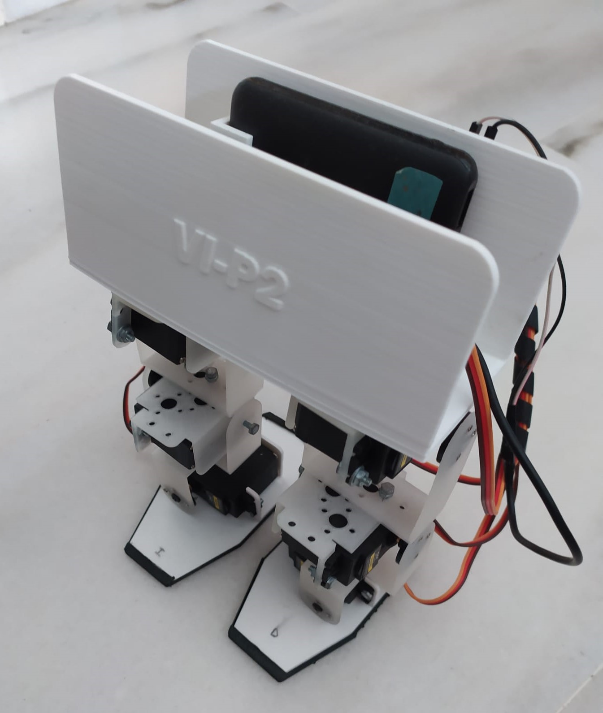

# Biped-Robot-Arduino-Project
This repository contains all the main files involved in the development of the Final degree project in Electronic Systems Engineering from the University of Malaga.
- PCB_ESP32_UnaCara_Galgas: This folder contains all the files from the KiCad project (PCI/PCB development).
- STL Biped Robot: This folder contains all the STL files of the 3D printed parts used to build the robot.
- analog_IMU_esp32_filter: This folder contains the Arduino codes for the stability control (the analog part is commented and not used).
- ik_v14_esp32: This folder contains the Arduino codes for making the robot walk (mainly inverse kinematics).

  

<iframe width="320" height="180" src="https://youtu.be/9EZOrU6Eoao" title="Walking Demo" frameborder="0" allow="accelerometer; autoplay; clipboard-write; encrypted-media; gyroscope; picture-in-picture" allowfullscreen="1"></iframe>

<iframe width="320" height="180" src="https://youtu.be/RL2hidtPSPY" title="Stabilization Demo" frameborder="0" allow="accelerometer; autoplay; clipboard-write; encrypted-media; gyroscope; picture-in-picture" allowfullscreen="1"></iframe>
